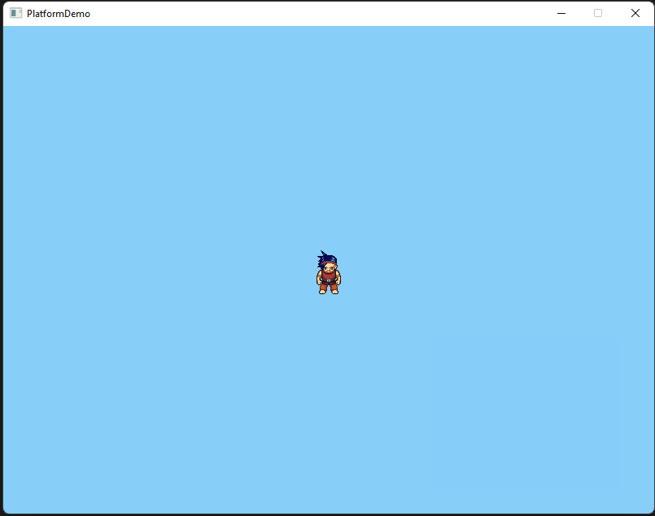

# Adding Movement

## Moving a Sprite

There are a number of options available for moving a sprite around we will start by setting an XY coordinate to move our spirit to a starting position then we will use the sprite's velocity properties to have it move in the nominated direction. Alternatively, you can adjust the sprite's XY property for the same effect.&#x20;

We will set the hero to the middle of the screen so we will need to calculate the middle of the screen and the middle of the hero and remove that from the screen calculation to get the correct XY coordinate for the hero.&#x20;

```csharp
_sHero.MoveTo(_gameWindow.Width/2-_sHero.Width/2,_gameWindow.Height/2-_sHero.Height/2);
```


In C# XY Coordinates start in the top-left of our window so when we first drew our Hero it was at X = 0, Y = 0. Our Hero Sprite is the same his XY coordinates are at the top left and he is drawn 64 pixels down and left.&#x20;


### Handle Inputs

So now we have our Heos in the middle of the screen we can get him walking at first well let him move in every direction but later he will feel the pull of gravity.

Make a new method called Handle Inputs here we will set up actions with the arrow keys to change the hero's velocity to move him around. Also, make sure we add this to the update method also `SplashKit.UpdateAllSprites();` so our sprite's position updates based on velocity.&#x20;

So we have set our speed to 4 so the hero will move 4 pixels in the nominated direction here we use dX and dY to set the XY velocity and speed on key release we set it back to 0 when turning left or right we also hide the forward facing layer of the sprite and show the right or left layer.&#x20;



```csharp
//add to update method
SplashKit.UpdateAllSprites();
HandleInput();

//New Handle Input method
    public void HandleInput()
    {
        int Speed = 4;
        if(SplashKit.KeyDown(KeyCode.LeftKey))
        {
            _sHero.Dx = -Speed;
            _sHero.HideLayer(0);
            _sHero.ShowLayer(1);
        }

        if(SplashKit.KeyDown(KeyCode.RightKey))
        {
            _sHero.Dx = Speed;
            _sHero.HideLayer(0);
            _sHero.ShowLayer(2);
        }

        if(SplashKit.KeyReleased(KeyCode.LeftKey))
        {
            _sHero.Dx = 0;
            _sHero.HideLayer(1);
            _sHero.ShowLayer(0);
        }
        if(SplashKit.KeyReleased(KeyCode.RightKey))
        {
            _sHero.Dx = 0;
            _sHero.HideLayer(2);
            _sHero.ShowLayer(0);
        }
        if(SplashKit.KeyDown(KeyCode.UpKey)) _sHero.Dy = -Speed;
        if(SplashKit.KeyReleased(KeyCode.UpKey)) _sHero.Dy = 0;
        if(SplashKit.KeyDown(KeyCode.DownKey)) _sHero.Dy = Speed;
        if(SplashKit.KeyReleased(KeyCode.DownKey)) _sHero.Dy = 0;
    }


```

#### Congratulations!!! you have a hero that can move :smile:
