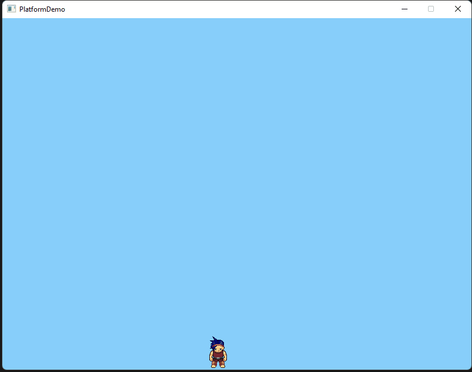

# Gravity and Jumping

## Gravity

Since we are making a platform game Gravity will play a big role to simulate gravity we are going to add a downward velocity to our hero. Create a new Method Gravity, remember to add it to the update method.&#x20;

We define gravity with a rate of 1 and a maximum of 10(TV) this gives us a slightly increasing gravity of game cycles it's only a fraction of a second but it smooths things out a little and fixes some strange behaviour with collisions later.&#x20;

```csharp
public void Gravity()
{
    const float G = 1; //Gravity
    const float TV = 10;//terminal Velocity
    if(_sHero.Dy<TV) _sHero.Dy += G;
}
```

Now you will have noticed our hero fell straight through the bottom of the screen now to prevent that and to stop him from running off the sides we will set some boundaries. Remember to add this to the Update method. This just calculates the Sides and bottom and makes sure the hero's XY can not go past them.

```csharp
void StayOnWindow()
{
    int margin = 1;
    if (_sHero.X < 0 + margin) _sHero.X = margin;
    if (_sHero.X > _gameWindow.Width - _sHero.Width - margin) _sHero.X = _gameWindow.Width - _sHero.Width - margin;
    if (_sHero.Y > _gameWindow.Height - _sHero.Height - margin) _sHero.Y = _gameWindow.Height - _sHero.Height - margin;
}
```

## Jumping

Now time to introduce an important feature for our hero the ability to jump, now we're just going to introduce a very simple jump here with no limits later we will introduce a more complicated jump with an upper limit and interactions with platforms.&#x20;

We have set the jump rate at -8 pixels and this applies to the hero's upper velocity overriding gravity. Add the following to the Handel Input method you can also remove the up and down keys.

```csharp
if(SplashKit.KeyDown(KeyCode.SpaceKey))
{
    const float Jump = -8;
    _sHero.Dy = Jump;
}
```

<figure><figcaption></figcaption></figure>

#### Congratulations on reaching the end of part 1

Next time we will add animations and platforms.&#x20;


### Full Code

```csharp
using System;
using SplashKitSDK;
using System.Collections.Generic;

namespace SpriteDemo_Stage1
{
    public class Program
    {
        public static void Main()
        {
            Window gameWindow = new Window("PlatformDemo",800,600);
            Game MyGame = new Game(gameWindow);

            while ( ! gameWindow.CloseRequested )
            {
                MyGame.Update();
            }
            gameWindow.Close();
        }
    }
}

public class Game
{
    private Window _gameWindow;
    private Sprite _sHero;
    public Game(Window gameWindow)
    {
        _gameWindow = gameWindow;

/*         Bitmap PlayerFront = new Bitmap("PlayerFront", "Char_Front.png");
        Bitmap PlayerLeft = new Bitmap("PlayerLeft", "Char_Left.png");
        Bitmap PlayerRight = new Bitmap("PlayerRight", "Char_Right.png");
        _sHero = SplashKit.CreateSprite("Hero", PlayerFront);
        _sHero.AddLayer(PlayerLeft,"MoveLeft");
        _sHero.AddLayer(PlayerRight,"MoveRight"); */
        
        int[] CellList = {26,65,143};
        Bitmap _PlayerAll = new Bitmap("PlayerBMP","Character.png");
        _PlayerAll.SetCellDetails(64,64,13,21,273);

        foreach(int i in CellList)
        {
            Bitmap PlayerBMP = new Bitmap("PlayerFront", 64, 64);
            SplashKit.DrawBitmapOnBitmap(PlayerBMP, _PlayerAll, 0, 0, SplashKit.OptionWithBitmapCell(i));
            PlayerBMP.SetupCollisionMask();
            if (i == 26) _sHero = SplashKit.CreateSprite("Hero", PlayerBMP);
            else _sHero.AddLayer(PlayerBMP,$"Cell {i}");
        }
        _sHero.MoveTo(_gameWindow.Width/2-_sHero.Width/2,_gameWindow.Height/2-_sHero.Height/2);

    }
    
    public void Update()
    {
        SplashKit.ProcessEvents();
        _gameWindow.Clear(Color.LightSkyBlue);
        SplashKit.DrawAllSprites();
        SplashKit.UpdateAllSprites();
        HandleInput();
        Gravity();
        StayOnWindow();
        _gameWindow.Refresh(60);  
    }
    public void HandleInput()
    {
        int Speed = 4;
        if(SplashKit.KeyDown(KeyCode.LeftKey))
        {
            _sHero.Dx = -Speed;
            _sHero.HideLayer(0);
            _sHero.ShowLayer(1);
        }

        if(SplashKit.KeyDown(KeyCode.RightKey))
        {
            _sHero.Dx = Speed;
            _sHero.HideLayer(0);
            _sHero.ShowLayer(2);
        }

        if(SplashKit.KeyReleased(KeyCode.LeftKey))
        {
            _sHero.Dx = 0;
            _sHero.HideLayer(1);
            _sHero.ShowLayer(0);
        }

        if(SplashKit.KeyReleased(KeyCode.RightKey))
        {
            _sHero.Dx = 0;
            _sHero.HideLayer(2);
            _sHero.ShowLayer(0);
        }

        if(SplashKit.KeyDown(KeyCode.SpaceKey))
        {
            const float Jump = -8;
            _sHero.Dy = Jump;
        }

    }

    public void Gravity()
    {
        const float G = 1; //Gravity
        const float TV = 10;//terminal Velocity
        if(_sHero.Dy<TV) _sHero.Dy += G;
    }

    void StayOnWindow()
    {
        int margin = 1;
        if (_sHero.X < 0 + margin) _sHero.X = margin;
        if (_sHero.X > _gameWindow.Width - _sHero.Width - margin) _sHero.X = _gameWindow.Width - _sHero.Width - margin;
        if (_sHero.Y > _gameWindow.Height - _sHero.Height - margin) _sHero.Y = _gameWindow.Height - _sHero.Height - margin;
    }         

}
```
