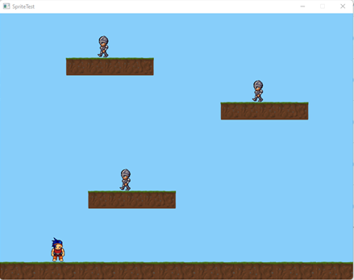
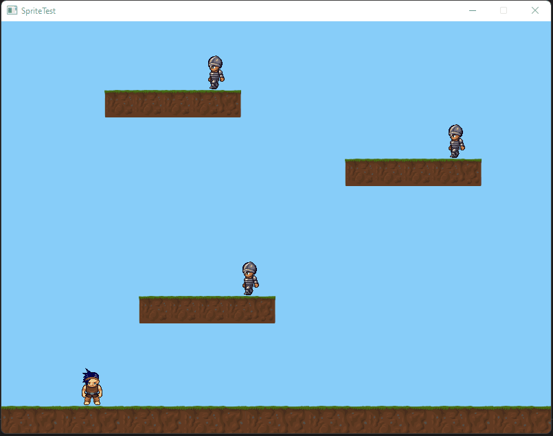
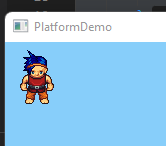
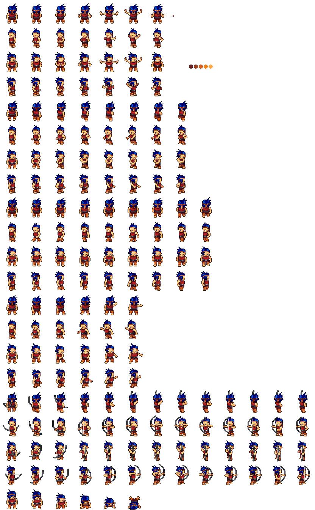

# C# Splashkit: Building a Platformer Game

## Overview

This Guide will show you the basics of working with sprites, how to get them moving, Animate them and have them interact with each other to do this we are going to build a very simple game with our hero that can run and jump on platforms and some adversaries. This Guide assumes you know the basics of Splashkit and how to build a C# program in VS Code.

By the end, you should have something like this.

<div>

<figure><figcaption><p>Your Final Game</p></figcaption></figure>

 

<figure><figcaption></figcaption></figure>

</div>

## What is a Sprite

In Splashkit, a sprite is a game asset with several properties that make them easier to control and interact with. They have built-in collision detection and can be moved manually or have velocity applied to move in a direction. Check out the [Sprite API list](https://splashkit.io/api/sprites/) for a complete list of capabilities.

### Creating a Sprite

I will show you two methods of creating your sprites with layers; later, when we use animations, the animation will take care of all the layering. To begin with, make sure you have created a new C# program using Splashkit "SKM`dotnet New`", and add a resources/images folder to your project. The code sample below will also have a Game class, window and main loop setup, but we will concentrate on how to use sprites.


Splaskkit has a number of pre-configured resource paths it knows how to access. See [Resource Kind](https://splashkit.io/api/resources/#resource-kind) for the list. Our demo file has this structure available for you.



Resource files for our platfrom game


Before we can create our Hero Sprite, we need a bitmap image. We have one of our hero facing forwards, and we will create our sprite.

```csharp
Bitmap PlayerFront = new Bitmap("PlayerFront","Char_Front.png");
_sHero = SplashKit.CreateSprite("Hero",PlayerFront);
```

If we add some additional code to create our game window, game loop, clear and refresh the screen we can draw out sprite. You can use `SplashKit.DrawSprite(_sPlayer);` to draw just the player sprite but we will be using `SplashKit.DrawAllSprites();` to draw all sprites.&#x20;



Now we only have one layer so far but we will add another two so our hero can turn Left and right once we add movement.&#x20;

```csharp
Bitmap PlayerFront = new Bitmap("PlayerFront", "Char_Front.png");
Bitmap PlayerLeft = new Bitmap("PlayerLeft", "Char_Left.png");
Bitmap PlayerRight = new Bitmap("PlayerRight", "Char_Right.png");
_sHero = SplashKit.CreateSprite("Hero", PlayerFront);
_sHero.AddLayer(HeroLeft,"MoveLeft");
_sHero.AddLayer(HeroRight,"MoveRight");
```

Now as an alternative if you have a sprite sheet like we do you can take target cells and draw them to bitmaps to create our sprites, this is the method we will use going forwards but both examples will be in the code. Our sprite sheet has 13 columns by 21 rows and the images are 64 x 64 pixels which works out to 273 cells which is what we will tell Splashkit. See [Bitmap Set Cell Details](https://splashkit.io/api/graphics/#bitmap-set-cell-details).

```csharp
_PlayerAll.SetCellDetails(64,64,13,21,273); //(width, height, colums, rows, count)
```

&#x20;


Our sprite sheet was generated using the [Universal LPC Spritesheet Generator](https://sanderfrenken.github.io/Universal-LPC-Spritesheet-Character-Generator/) please see [credits-and-acknowledgments.md](acknowledgments/credits-and-acknowledgments.md "mention") for contributors.


In the following code we are going to:

* Create an array listing the cells we want to target
* Create a new blank bitmap
* Draw the sprite cell to the bitmap&#x20;
* Setup Collision Mask&#x20;
  * Necessary when not using a bitmap file. You need this for the sprite to have collisions
* First, run create the sprite
* Subsequent runs add layers

```csharp
int[] CellList = {26,65,143};
Bitmap _PlayerAll = new Bitmap("PlayerBMP","Character.png");
_PlayerAll.SetCellDetails(64,64,13,21,273);

foreach(int i in CellList)
{
    Bitmap PlayerBMP = new Bitmap("PlayerFront", 64, 64);
    SplashKit.DrawBitmapOnBitmap(PlayerBMP, _PlayerAll, 0, 0, SplashKit.OptionWithBitmapCell(i));
    PlayerBMP.SetupCollisionMask();
    if (i == 26) _sHero = SplashKit.CreateSprite("Hero", PlayerBMP);
    else _sHero.AddLayer(PlayerBMP,$"Cell {i}");
}
```

#### Our Code So far

```csharp
using System;
using SplashKitSDK;
using System.Collections.Generic;

namespace SpriteDemo_Stage1
{
    public class Program
    {
        public static void Main()
        {
            Window gameWindow = new Window("PlatformDemo",800,600);
            Game MyGame = new Game(gameWindow);

            while ( ! gameWindow.CloseRequested )
            {
                MyGame.Update();
            }
            gameWindow.Close();
        }
    }
}

public class Game
{
    private Window _gameWindow;
    private Sprite _sHero;
    public Game(Window gameWindow)
    {
        _gameWindow = gameWindow;

/*         Bitmap PlayerFront = new Bitmap("PlayerFront", "Char_Front.png");
        Bitmap PlayerLeft = new Bitmap("PlayerLeft", "Char_Left.png");
        Bitmap PlayerRight = new Bitmap("PlayerRight", "Char_Right.png");
        _sHero = SplashKit.CreateSprite("Hero", PlayerFront);
        _sHero.AddLayer(PlayerLeft,"MoveLeft");
        _sHero.AddLayer(PlayerRight,"MoveRight"); */
        
        int[] CellList = {26,65,143};
        Bitmap _PlayerAll = new Bitmap("PlayerBMP","Character.png");
        _PlayerAll.SetCellDetails(64,64,13,21,273);

        foreach(int i in CellList)
        {
            Bitmap PlayerBMP = new Bitmap("PlayerFront", 64, 64);
            SplashKit.DrawBitmapOnBitmap(PlayerBMP, _PlayerAll, 0, 0, SplashKit.OptionWithBitmapCell(i));
            PlayerBMP.SetupCollisionMask();
            if (i == 26) _sHero = SplashKit.CreateSprite("Hero", PlayerBMP);
            else _sHero.AddLayer(PlayerBMP,$"Cell {i}");
        }

    }

    public void Update()
    {
        SplashKit.ProcessEvents();
        _gameWindow.Clear(Color.LightSkyBlue);
        SplashKit.DrawAllSprites();
        _gameWindow.Refresh(60);  
    }
}
```
