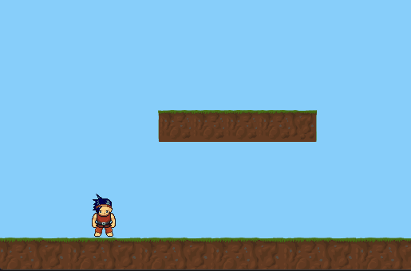
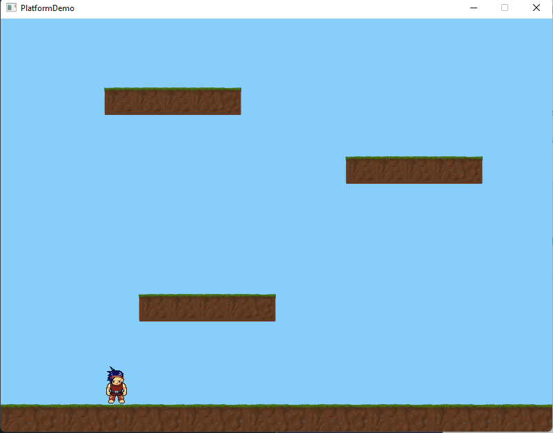

# Adding Platforms

Now our hero can run around and jump; it would be nice if he had something to run and jump onto, so let's add some ground and platforms.&#x20;

## The Setup

Since we are using sprites for our platforms and not worrying about any special capabilities, we won't make a platform class; instead, we will create a list in the Game class and add our platforms to it. Create a new public sprite list.&#x20;

```csharp
public List<Sprite> _sPlatforms = new List<Sprite>();
```

Then in the Game constructor, add the following bitmaps and four platforms and move them to the specified coordinates.&#x20;

```csharp
Bitmap bGround = new Bitmap("TheGround", "Ground.png");
Bitmap bPlatform = new Bitmap("Platform","Platform.png");

_sPlatforms.Add(SplashKit.CreateSprite("TheGround", bGround));
_sPlatforms[0].MoveTo(0,560);

_sPlatforms.Add(SplashKit.CreateSprite("Platform1", bPlatform));
_sPlatforms[1].MoveTo(200,400);

_sPlatforms.Add(SplashKit.CreateSprite("Platform2", bPlatform));
_sPlatforms[2].MoveTo(500,200);

_sPlatforms.Add(SplashKit.CreateSprite("Platform3", bPlatform));
_sPlatforms[3].MoveTo(150,100);
```

Now you may have noticed our hero fell straight through the ground. Let's fix that.&#x20;

.png>)

## Solid Ground

To make our ground solid, we will use the sprite collision function to detect when the hero touches a platform and then set his Y coordinate so he can not fall through. Make a new CollisionCheck method in the Hero class, remember to add it to the update method, and add \_Bottom calculation to the top of the Hero class.

<pre class="language-csharp"><code class="lang-csharp">//Add _bottom variable with get to Hero class
    private float _Bottom
    {
        get { return _sHero.Y + _sHero.Height; }
    }
    
<strong>//Add Method to Hero class
</strong>public void CollisionCheck()
{
    foreach (Sprite p in _TheGame._sPlatforms)
    {
        Rectangle rect = p.CollisionRectangle;
        if (SplashKit.SpriteCollision(_sHero, p))
        {   
            //Top of Platform check            
            if (SplashKit.RectangleTop(rect) &#x3C;=_Bottom &#x26;&#x26;  SplashKit.RectangleBottom(rect) >= _Bottom)
            {
                _isFalling = false;
                _isJumping = false;
                _sHero.Y = Convert.ToSingle(rect.Y - _sHero.Height + 1);
            }
        }
    }
} 
</code></pre>

In the above code, our collision check looks at each platform and checks if the player is touching it. If they are then we check the bottom of the player to see if his feet will be inside the platform if they are he's popped up on top of the platform by adding the player's height to the platform Y position.&#x20;



Now you might have noticed we can jump through the bottom of the platform which is fine but I don't want my hero to be able to jump through the bottom so we will add one more check to see if he tries to go through the bottom and limit his Y movement. Add the following above our Top of Platform check. &#x20;

```csharp
if (SplashKit.RectangleBottom(rect) >= _sHero.Y-5 && SplashKit.RectangleTop(rect)  <=_sHero.Y)
{
    _isFalling = true;
    _isJumping = true;
    _sHero.Y = SplashKit.RectangleBottom(rect);
} 
```

<figure><figcaption></figcaption></figure>

#### Congratulations you have a platform game :smile:

As a bonus, we will show you how to create some adversaries on the next page.


## Full Code So Far

```csharp
using System;
using SplashKitSDK;
using System.Collections.Generic;

namespace SpriteDemo_Stage2
{
    public class Program
    {
        public static void Main()
        {
            Window gameWindow = new Window("PlatformDemo",800,600);
            Game MyGame = new Game(gameWindow);

            while ( ! gameWindow.CloseRequested )
            {
                MyGame.Update();
            }
            gameWindow.Close();
        }
    }
}

public class Game
{
    private Window _gameWindow;
    private Hero _Hero;
    public List<Sprite> _sPlatforms = new List<Sprite>();
    public Game(Window gameWindow)
    {
        _gameWindow = gameWindow;
        _Hero = new Hero(_gameWindow,this);

        Bitmap bGround = new Bitmap("TheGround", "Ground.png");
        Bitmap bPlatform = new Bitmap("Platform","Platform.png");

        _sPlatforms.Add(SplashKit.CreateSprite("TheGround", bGround));
        _sPlatforms[0].MoveTo(0,560);

        _sPlatforms.Add(SplashKit.CreateSprite("Platform1", bPlatform));
        _sPlatforms[1].MoveTo(200,400);

        _sPlatforms.Add(SplashKit.CreateSprite("Platform2", bPlatform));
        _sPlatforms[2].MoveTo(500,200);

        _sPlatforms.Add(SplashKit.CreateSprite("Platform3", bPlatform));
        _sPlatforms[3].MoveTo(150,100);
    }
    
    public void Update()
    {
        SplashKit.ProcessEvents();
        _gameWindow.Clear(Color.LightSkyBlue);
        SplashKit.DrawAllSprites();
        SplashKit.UpdateAllSprites();
        _Hero.Update();
        _gameWindow.Refresh(60);  
    }
}

public class Hero
{
    private Window _gameWindow;
    private Game _TheGame;
    private Sprite _sHero;
    private bool _isJumping;
    private bool _isFalling;
    private float _JumpLimit;
    private float _Bottom
    {
        get { return _sHero.Y + _sHero.Height; }
    }
    public Hero(Window gameWindow, Game Game)
    {
        _gameWindow = gameWindow;
        _TheGame = Game;

        Bitmap _PlayerAll = new Bitmap("PlayerBMP","Character.png");
        _PlayerAll.SetCellDetails(64,64,13,21,273);
        AnimationScript PlayerAnim = SplashKit.LoadAnimationScript("WalkingScript", "Hero.txt");
        _sHero = SplashKit.CreateSprite("Player1", _PlayerAll, PlayerAnim);
        _sHero.StartAnimation("FaceForward");
        _sHero.MoveTo(100, 150);

        _isFalling = true;
    }

    public void Update()
    {
        HandleInput();
        Gravity();
        StayOnWindow();
        CollisionCheck();
    }
    public void HandleInput()
    {
        if (SplashKit.KeyDown(KeyCode.LeftKey)) if (_sHero.AnimationHasEnded) _sHero.StartAnimation("WalkLeft");
        if (SplashKit.KeyDown(KeyCode.RightKey)) if (_sHero.AnimationHasEnded) _sHero.StartAnimation("WalkRight");
        if (SplashKit.KeyReleased(KeyCode.LeftKey)) _sHero.StartAnimation("FaceForward");
        if (SplashKit.KeyReleased(KeyCode.RightKey)) _sHero.StartAnimation("FaceForward");
        if (SplashKit.KeyDown(KeyCode.SpaceKey)) Jump();
        if (SplashKit.KeyReleased(KeyCode.SpaceKey))
         {
            _isFalling = true;
            _sHero.Dy = 0;
         }

    }

    private void Gravity()
    {
        const float G = 5; //Gravity
        const float TV = 10;//Terminal Velocity
        if (_isFalling)
        {
            if (_sHero.Dy < TV) _sHero.Dy += G;
        } 
    }

    void StayOnWindow()
    {
        int margin = 1;
        if (_sHero.X < 0 + margin) _sHero.X = margin;
        if (_sHero.X > _gameWindow.Width - _sHero.Width - margin) _sHero.X = _gameWindow.Width - _sHero.Width - margin;
        if (_sHero.Y > _gameWindow.Height - _sHero.Height - margin)
        {
            _sHero.Y = _gameWindow.Height - _sHero.Height - margin;
            _isFalling = false;
            _isJumping = false;
        }
    }
    private void Jump()
    {
        const float JumpSpeed = -8;
        if (!_isJumping)
        {
            _isFalling = false;
            _isJumping = true;
            _JumpLimit = (_sHero.Y - _sHero.Height * 3);
        }

        if (_isJumping && !_isFalling)
        {
            if (_sHero.Y > _JumpLimit)
            {
                _sHero.Dy = JumpSpeed;
            }
            else
            {
                _isFalling = true;
            }
        } 
    }

    public void CollisionCheck()
    {
        foreach (Sprite p in _TheGame._sPlatforms)
        {
            Rectangle rect = p.CollisionRectangle;
            if (SplashKit.SpriteCollision(_sHero, p))
            {   
                //Bottom of Platform check
                if (SplashKit.RectangleBottom(rect) >= _sHero.Y-5 && SplashKit.RectangleTop(rect)  <=_sHero.Y)
                {
                    _isFalling = true;
                    _isJumping = true;
                    _sHero.Y = SplashKit.RectangleBottom(rect);
                } 

                //Top of Platform check          
                if (SplashKit.RectangleTop(rect) <=_Bottom &&  SplashKit.RectangleBottom(rect) >= _Bottom)
                {
                    _isFalling = false;
                    _isJumping = false;
                    _sHero.Y = Convert.ToSingle(rect.Y - _sHero.Height + 1);
                }
            }
        }
    }      
}


```
