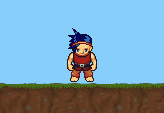

# Animations

## Welcome to Part 2

Welcome to the second half of this tutorial; if you have followed along with the first half, you should have our hero running around and jumping. Part 2 will show you how to get animations and sprites working together, build platforms & ground, and spawn adversaries. If you are after an in-depth view of how animations work in Splashkit, I suggest reading this guide [Using Animations](https://splashkit.io/articles/guides/tags/animations/animation/), by Andrew Cain.&#x20;

## Animations Overview

So far, our Hero Sprite turns depending on the direction he is heading. Now we will add a full walking animation from our sprite sheet. Animations work but using cells defined in our sprite sheet and showing them in succession to give the appearance of motion.&#x20;

<div align="left">

<figure><figcaption><p>Walking Cells</p></figcaption></figure>

</div>

<figure><figcaption><p>Walking Motion</p></figcaption></figure>

Now for animations each cell being displayed acts as a frame. Using a text file as configuration we define

* ID (frame number)
* CELL (cell number on sprite sheet)
* Duration (how many times the frame is displayed before moving to the next frame)
* Next (The next frame to display)

This notation can either be written per cell or using set notation to group frames and cells. We will be using set notation to group our walking sequence but you will see frame 99 defined as a single this is our forward-facing cell/frame.&#x20;

In our config file, we have the following command notations

* **f:** Defines a frame or frame sequence
  * **f:99,78,1,**    is our forward-facing frame, Frame ID: 99, Cell Number from Sprite Sheet: 99,  duration 1, and no follow-on frame.
  * **f:\[0-8],\[143-151],3,** represents our walking sequence from frame 0 to 9, cells 143- 151 as in the above picture each frame is displayed for 3 cycles increasing this makes the hero appear to walk slower and no follow on frame as we want the animation to end once the sequence completes.&#x20;
* **i:** Is an animation identifier, used to call the first frame in the animation sequence.
  * &#x20;**i:WalkRight,0**  when we tell the program to start the walk right animation it will call frame 0 and then the rest of the sequence.
* **v:**  Is an option that can be used with sprites to apply velocity based on the frame.
  * **v:\[0-8],4,0**  for frames 0 to 8 and X velocity of 2 and Y velocity of 0 will be applied. we will be using this going forwards for our left and right movement.
* **s:** Is also available to play a sound on a given frame. We are not using it in this tutorial.
  * s: Identifier, SoundName, Filename if you want to experiment using sounds

This is our configuration file for animating our hero as you will notice we are only using two rows in our sprite sheet there is a lot more we could add if we wanted.&#x20;

```
SplashKit Animation

//Frames are declared with an f: and contain
//the following comma separated values
//ID,CELL,DUR,NEXT
f:99,78,1,

//Multi-frame: ranges are in[]
//[a-b] = numbers from a to b inclusive
//[a,b,c] = explicit values
//[a-b,c] = combination
f:[0-8],[143-151],3,
f:[9-17],[117-125],3,

// -- Animation Identifiers --
i:WalkRight,0
i:WalkLeft,9
i:FaceForward,99

//v: identifier, change in x velocity, change in y velocity 
v:[0-8],4,0
v:[9-17],-4,0
v:99,0,0

//s: Identifier, SoundName, Filename 
```
